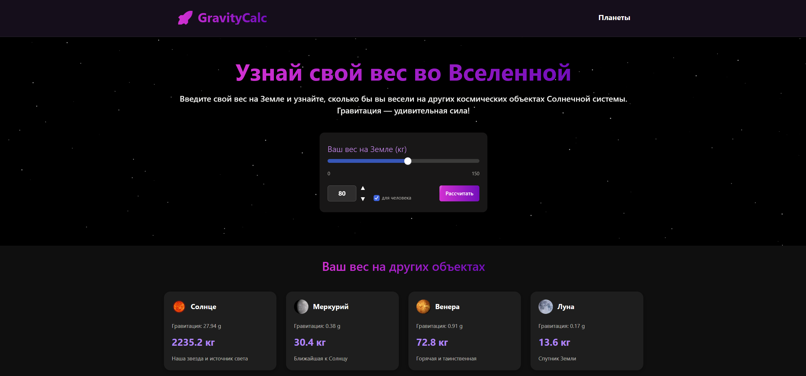

# Open Source Project by Nevionn

[Калькулятор для расчета веса на различных космических объектах](https://gravity-calc.vercel.app/)

<div align="center" style="display: flex; align-items: center;">
  
</div>

# Стек технологий

<div align="center" style="display: flex; align-items: center;">


</div>

# Установка из исходников

```bash
git clone https://github.com/Nevionn/Gravity-calc.git

cd gravity-calc

npm install

npm run dev
```

## ССЫЛКИ

[](https://t.me/ancient_nevionn)
[](https://www.donationalerts.com/r/nevion)
